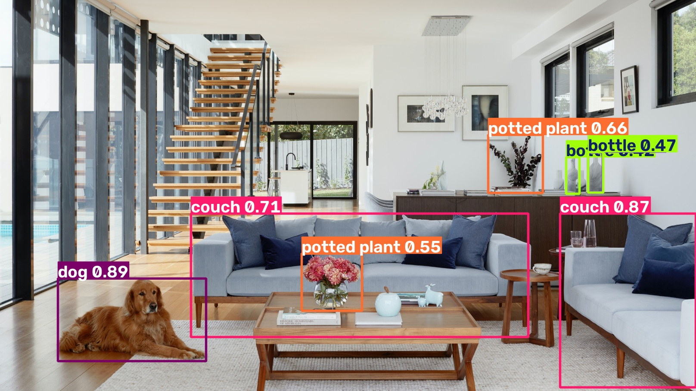

# YOLO Object Detection

This project uses YOLOv8 and OpenCV to detect and classify multiple objects in images.

## Features

- Detects multiple objects in a single image
- Draws bounding boxes around detected objects
- Displays object names
- Displays confidence scores
- Processes JPG, JPEG, and PNG images
- Saves detected output images automatically

## Technologies Used

- Python
- YOLOv8
- Ultralytics
- OpenCV
- VS Code
- Git and GitHub

## Project Structure

```text
YOLO-Object-Detection/
├── input_images/
├── output_images/
│   └── results/
├── image_detection.py
├── webcam_detection.py
├── requirements.txt
├── .gitignore
└── README.md
```

## Installation

First, create a virtual environment:

```bash
python -m venv venv
```

Activate the virtual environment.

For Windows PowerShell:

```powershell
.\venv\Scripts\Activate.ps1
```

Install the required dependencies:

```bash
pip install -r requirements.txt
```

## Run the Project

Place the images that you want to test inside the:

```text
input_images/
```

folder.

Then run:

```bash
python image_detection.py
```

The program will process all supported images inside the folder.

The detected output images will be saved inside:

```text
output_images/results/
```

## Supported Image Formats

The project currently supports:

```text
.jpg
.jpeg
.png
```

## YOLO Model

This project uses the pretrained YOLOv8 Nano model:

```text
yolov8n.pt
```

The model is provided through the Ultralytics YOLO package.

If the model file is not already available, it will be downloaded automatically when the program runs for the first time.

## How It Works

1. The YOLOv8 model is loaded.
2. The program reads images from the `input_images` folder.
3. YOLO analyzes each image.
4. Objects are detected and classified.
5. Bounding boxes are drawn around the detected objects.
6. Object names and confidence scores are displayed.
7. The processed images are saved in the `output_images/results` folder.

## Example Detections

The model can detect many common objects such as:

- Person
- Car
- Bus
- Bicycle
- Motorcycle
- Dog
- Cat
- Chair
- Couch
- Bottle
- Potted plant
- And many other objects available in the pretrained YOLO model

## Confidence Score

YOLO displays a confidence score for each detected object.

For example:

```text
dog 0.89
```

This means the model has approximately 89% confidence that the detected object is a dog.

## Limitations

- Some objects may be classified incorrectly.
- Small objects may not always be detected.
- Partially hidden objects may be missed.
- Detection accuracy depends on image quality.
- The pretrained model can only recognize the classes it was trained on.
- Objects outside the model's known classes may be classified incorrectly.

## Future Improvements

Possible improvements include:

- Training YOLO on a custom dataset
- Adding custom object classes
- Detecting objects in video files
- Real-time webcam detection
- Improving accuracy using larger YOLO models
- Adding a graphical user interface
- Evaluating the model using precision, recall, and mAP

## Author

Developed as a YOLO-based Object Detection project using Python, OpenCV, and Ultralytics YOLOv8.
## Sample Detection Result

Below is an example of YOLOv8 detecting multiple objects in an image:

